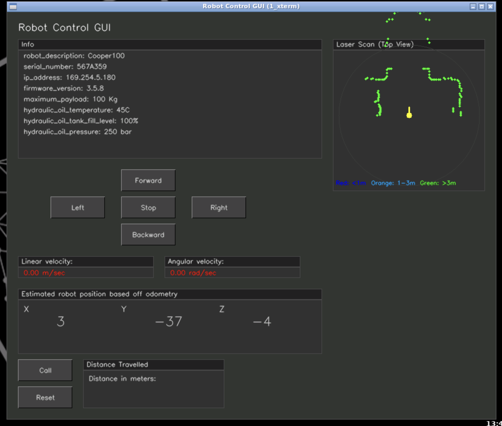

# Robot GUI - Graphical Control Interface

A comprehensive graphical user interface for teleoperating and monitoring mobile robots, built with ROS, C++, OpenCV, and the CVUI library.



## Overview

This package provides a user-friendly GUI that enables operators to:
- View real-time robot information
- Control robot movement via teleoperation buttons
- Monitor current velocities
- Track robot position using odometry
- Query distance traveled
- Visualize laser scan data in real-time

## Features

### 1. **General Info Area**
- Displays up to 10 configurable robot information fields
- Subscribes to `/robot_info` topic
- Updates dynamically when new messages arrive
- Shows robot description, serial number, IP address, firmware version, and custom fields

### 2. **Teleoperation Controls**
- **Direction Buttons**: Forward, Backward, Left, Right, Stop
- **Incremental Control**: Each button press adjusts velocity by a fixed step
- **Combined Motion**: Multiple button presses accumulate (e.g., Forward + Left = diagonal movement)
- **Persistent Motion**: Robot continues moving until Stop button is pressed
- Publishes to `/cooper_1/cmd_vel` topic

### 3. **Current Velocity Display**
- Real-time linear velocity (m/sec)
- Real-time angular velocity (rad/sec)
- Updates immediately when teleoperation buttons are pressed

### 4. **Robot Position (Odometry-Based)**
- Displays X, Y, Z coordinates
- Subscribes to `/cooper_1/odom` topic
- Shows estimated position based on wheel encoders

### 5. **Distance Traveled Service**
- **Call Button**: Queries total distance traveled from `/get_distance` service
- **Reset Button**: Resets distance counter via `/reset_distance` service
- Displays distance in meters with 2 decimal precision

### 6. **Laser Scan Visualization** (Bonus Feature)
- Top-down radar-style view of laser scan data
- Color-coded by distance:
  - 🔴 Red: < 1m (danger zone)
  - 🟠 Orange: 1-3m (caution)
  - 🟢 Green: > 3m (safe)
- Shows robot position and forward direction
- Real-time obstacle detection display
- Subscribes to `/cooper_1/scan` topic

## Prerequisites

### Required Auxiliary Packages

**IMPORTANT**: Before building this package, you must first install the auxiliary packages:

```bash
cd ~/catkin_ws/src
git clone -b cooper https://bitbucket.org/theconstructcore/advanced_cpp_auxiliary_pkgs.git
```

This repository contains:
- **robotinfo_msgs**: Custom message definitions for robot information
- **CVUI library**: GUI framework (included in package headers)
- **distance_tracker_service**: Service for tracking robot distance
- **Example nodes**: Reference implementations for GUI patterns

## Installation

### 1. Clone the robot_info Repository

```bash
cd ~/catkin_ws/src
git clone https://github.com/donadol/robot_info.git
```

### 2. Install Auxiliary Packages

```bash
cd ~/catkin_ws/src
git clone -b cooper https://bitbucket.org/theconstructcore/advanced_cpp_auxiliary_pkgs.git
```

### 3. Build the Workspace

```bash
cd ~/catkin_ws
catkin_make
```

If you encounter build errors, try building the auxiliary packages first:

```bash
catkin_make --only-pkg-with-deps robotinfo_msgs
```

### 4. Source the Workspace

```bash
source ~/catkin_ws/devel/setup.bash
```

## Usage

### Running the GUI

1. **Start the robot_info node** (provides robot information):
   ```bash
   rosrun robot_info agv_robot_info_node
   ```

2. **Start the distance_tracker_service node** (tracks distance traveled):
   ```bash
   rosrun distance_tracker_service distance_tracker_service_node
   ```

3. **Launch the Robot GUI**:
   ```bash
   rosrun robot_gui robot_gui_node
   ```

### Keyboard Controls

- **ESC**: Exit the GUI application

### Teleoperation

1. Click the direction buttons to control the robot:
   - **Forward**: Increases forward velocity
   - **Backward**: Increases backward velocity
   - **Left**: Increases counter-clockwise rotation
   - **Right**: Increases clockwise rotation
   - **Stop**: Immediately stops all movement

2. Multiple clicks accumulate velocity (e.g., click Forward 3 times = 0.15 m/s)

3. Press **Stop** to halt all motion

### Distance Tracking

1. Click **Call** to query the current distance traveled
2. Click **Reset** to reset the distance counter to 0.00

## Configuration

### Velocity Step Sizes

Modify in `src/robot_gui.cpp` constructor:

```cpp
linear_velocity_step_ = 0.05;   // m/s per button press
angular_velocity_step_ = 0.1;   // rad/s per button press
```

### Topic and Service Names

Change topic names in `src/robot_gui.cpp` constructor:

```cpp
robot_info_topic_ = "robot_info";
cmd_vel_topic_ = "/cooper_1/cmd_vel";
odom_topic_ = "/cooper_1/odom";
laser_scan_topic_ = "/cooper_1/scan";
distance_service_name_ = "/get_distance";
reset_distance_service_name_ = "/reset_distance";
```

## Architecture

### ROS Communication

**Subscribers:**
- `/robot_info` (robotinfo_msgs/RobotInfo10Fields)
- `/cooper_1/odom` (nav_msgs/Odometry)
- `/cooper_1/scan` (sensor_msgs/LaserScan)

**Publishers:**
- `/cooper_1/cmd_vel` (geometry_msgs/Twist)

**Service Clients:**
- `/get_distance` (std_srvs/Trigger)
- `/reset_distance` (std_srvs/Empty)

### Class Structure

```
RobotGUI
├── Constructor: Initialize ROS communication
├── run(): Main GUI loop
├── robotInfoCallback(): Handle robot info updates
├── odomCallback(): Handle odometry updates
├── laserScanCallback(): Handle laser scan data
└── drawLaserScan(): Render laser scan visualization
```

## Troubleshooting

### No Robot Info Displayed

**Issue**: Info area shows empty fields.

**Solution**:
- Check if agv_robot_info_node is running: `rosnode list`
- Verify topic is publishing: `rostopic echo /robot_info -n1`
- Ensure robotinfo_msgs package is built and sourced

### Laser Scan Not Showing

**Issue**: Laser scan window shows "Waiting for scan data..."

**Solution**:
- Check if `/cooper_1/scan` topic is active: `rostopic list | grep scan`
- Verify laser scanner is enabled in simulation/hardware
- Echo the topic to see data: `rostopic echo /cooper_1/scan -n1`

### Build Errors

**Issue**: `fatal error: robotinfo_msgs/RobotInfo10Fields.h: No such file or directory`

**Solution**:
- Install auxiliary packages first (see Prerequisites)
- Build robotinfo_msgs before robot_gui:
  ```bash
  catkin_make --only-pkg-with-deps robotinfo_msgs
  ```

### Service Calls Failing

**Issue**: Distance service buttons show "Service call failed"

**Solution**:
- Start distance_tracker_service node
- Check if service is available: `rosservice list | grep distance`
- Test service manually: `rosservice call /get_distance "{}"`

## Technical Details

### Coordinate Transformations

The laser scan visualization converts polar coordinates (angle, distance) to Cartesian (x, y):

```cpp
angle = angle_min + i * angle_increment
displayAngle = angle - π/2  // Rotate so forward = up
x = distance * cos(displayAngle) * scale
y = distance * sin(displayAngle) * scale
```

## Performance

- **GUI Refresh Rate**: ~50 Hz (20ms wait in main loop)
- **ROS Callback Processing**: Single-threaded via `ros::spinOnce()`
- **Window Size**: 750x900 pixels

## Future Enhancements

Potential improvements:
- Add joystick/gamepad support
- Implement speed limits/safety zones
- Add battery status indicator
- Include camera feed visualization
- Add mission recording/playback
